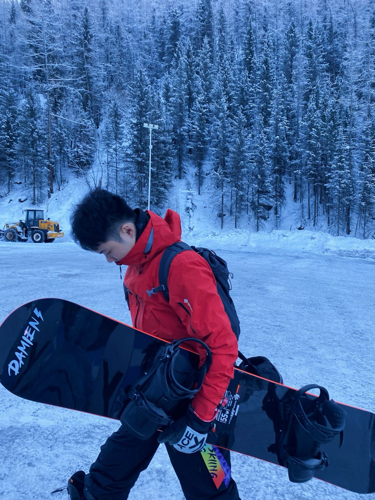

<!-- README Profile for Rongjunchen Zhang -->

  <!-- Typing headline -->

  

  <!-- Profile image -->

  

  <!-- Social badges -->

  

    
    
    
  

嗨，你好！我是 **张荣珺晨**，目前在 **同花顺** 担任大模型算法工程师。

* 💻 **热爱**: 培育AI，滑雪，徒步，潜水，网球
* 🌱 **专注**: 多模态落地应用，端到端Omni基座模型

> “Artificial Intelligence won’t replace you; a human who knows how to use it will.” — Andrew Ng

---

## 🏢 Work Experience

###  同花顺
**Role**: 大模型算法工程师（以AI技术重构世界）  
**Duration**: May 2023 — Present

---

## 🚀 Projects & Highlights

* **GAGE**: [General AI evaluation and Gauge Engine](https://github.com/HiThink-Research/GAGE)
* **BizFinBench**: [A Business-Driven Real-World Financial Benchmark for Evaluating LLMs](https://github.com/HiThink-Research/BizFinBench)
* **MME-Finance**: [A Multimodal Finance Benchmark for Expert-level Understanding and Reasoning](https://github.com/HiThink-Research/MME-Finance)

<!-- ---

## 🛠️ Skills & Technologies

  
Click to expand

* **Languages**: Python, JavaScript, TypeScript, C++
* **Frameworks**: React, Node.js, TensorFlow, PyTorch, vLLM
* **DevOps**: Docker, Kubernetes, Swift (RLHF), GitHub Actions
* **Data**: Pandas, NumPy, SQL, RESTful APIs
* **Tools**: Git, VSCode, JIRA

--- -->
